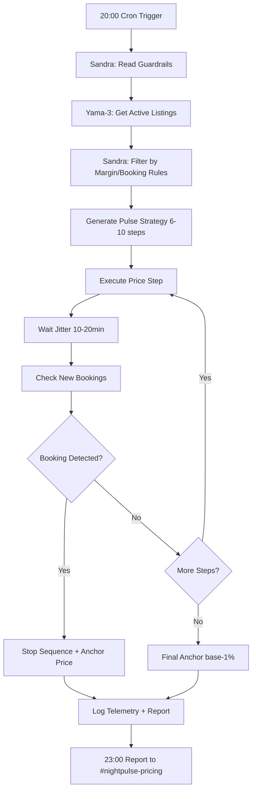

# 🌙 NIGHTPULSE AUTOMATION - Plan Maestro

**Sistema**: Automatización precios nocturnos 20:00-05:30 CEST  
**Coordinador**: George Thomas (CODE) - coordino, no programo  
**Orquestadora**: Sandra IA - gobierna guardarraíles + decisiones  
**Objetivo**: Maximizar visibilidad + reservas respetando márgenes + TOS

---

## 🎯 ESTRATEGIA NIGHTPULSE

### Ventana Operativa
- **Inicio**: 20:00 CEST (peak booking hours)
- **Fin**: 05:30 CEST (antes business hours)
- **Duración**: 9.5 horas automatización completa
- **Failsafe**: 22:30 CEST (reset precios intermedios)

### Metodología "Pulso"
- **Secuencia**: 6-10 cambios precio dentro 120min
- **Amplitud**: ±3-7% precio base (respetando floor/ceil)
- **Jitter**: 10-20min esperas aleatorias (anti-pattern detection)
- **Anclaje final**: base -1% (efecto descuento post-pulso)
- **Stop-on-booking**: Si reserva → detener secuencia + anclar precio

---

## 📊 N8N WORKFLOW BLUEPRINT

### Nodos Principales
```json
{
  "workflow": "NightPulse_Pricing_v1.0",
  "trigger": {
    "type": "cron",
    "expression": "0 20 * * *",
    "timezone": "Europe/Madrid"
  },
  "nodes": [
    {
      "name": "Listar_Anuncios",
      "type": "HTTP Request",
      "url": "https://yama-3.sandra.local/api/listings/active",
      "method": "GET",
      "auth": "bearer_token"
    },
    {
      "name": "Guardrails_Check",
      "type": "Function",
      "code": "return items.filter(item => item.margin >= 0.30 && item.bookings_7d < 5)"
    },
    {
      "name": "Generate_Pulse_Strategy",
      "type": "Function", 
      "code": "const steps = Math.floor(Math.random() * 5) + 6; return {steps, amplitude: Math.random() * 4 + 3}"
    },
    {
      "name": "Execute_Price_Step",
      "type": "HTTP Request",
      "url": "https://api.airbnb.com/v2/listings/{{$node.Listar_Anuncios.json.id}}/pricing",
      "method": "PATCH"
    },
    {
      "name": "Wait_Jitter",
      "type": "Wait",
      "duration": "{{Math.floor(Math.random() * 600 + 600)}}",
      "unit": "seconds"
    },
    {
      "name": "Booking_Check",
      "type": "HTTP Request", 
      "url": "https://yama-3.sandra.local/api/bookings/recent",
      "condition": "if new booking → stop sequence"
    },
    {
      "name": "Final_Anchor",
      "type": "Function",
      "code": "return {price: basePrice * 0.99, reason: 'nightpulse_discount'}"
    },
    {
      "name": "Telemetry_Log",
      "type": "HTTP Request",
      "url": "https://monitoring.sandra.local/nightpulse/metrics",
      "method": "POST"
    }
  ]
}
```

### Orquestación Sandra ↔ Yama-3


---

## 🛡️ GUARDARRAÍLES CRÍTICOS

### Business Rules (Inquebrantables)
```yaml
pricing_constraints:
  margin_minimum: 30%  # Nunca bajar margen <30%
  floor_price: "calculated_from_costs * 1.35"
  ceil_price: "market_rate * 1.15" 
  max_changes: 10  # Máximo 10 cambios/120min
  amplitude_limit: 7%  # Máximo ±7% variación
  
booking_rules:
  stop_on_booking: true
  anchor_on_stop: true
  log_stop_reason: "booking_received"
  
compliance_tos:
  api_rate_limit: "respect platform limits"
  no_scraping: "only official APIs or Channel Manager"
  realistic_pricing: "no artificial manipulation detection"
  
performance_guards:
  max_429_rate: 5%  # Si >5% 429s → pausar 30min
  response_timeout: 30s
  retry_attempts: 3
  circuit_breaker: "activate on 3 consecutive failures"
```

### Sandra IA Decision Tree
```python
def should_continue_pulse(listing_data, current_step, market_conditions):
    # Guardarraíl 1: Margen mínimo
    if listing_data['current_margin'] < 0.30:
        return False, "margin_too_low"
    
    # Guardarraíl 2: Reservas vs media 7d
    recent_bookings = get_bookings_last_hour()
    if recent_bookings > 0:
        return False, "booking_received"
    
    # Guardarraíl 3: ROAS deterioro
    current_roas = calculate_roas(listing_data['id'])
    if current_roas < 2.5:
        return False, "roas_too_low"
    
    # Guardarraíl 4: Patrón sospechoso
    price_changes_today = count_price_changes(listing_data['id'])
    if price_changes_today > 15:
        return False, "too_many_changes"
    
    # Continuar pulso
    return True, "continue_sequence"
```

---

## 📈 MÉTRICAS & ALERTAS

### KPIs NightPulse
- **Delta vistas**: Incremento vistas 20:00-23:00 vs baseline
- **Delta guardados**: Saves/favorites durante ventana  
- **Conversion booking**: Reservas en ventana vs fuera ventana
- **Revenue impact**: €/hora durante automatización
- **Stop rate**: % secuencias detenidas por booking
- **Compliance**: 429 rate, API health, TOS violations

### Dashboard Real-time
```yaml
panels:
  nightpulse_health:
    - active_listings: "count currently in pulse"
    - avg_price_variance: "±% from base price"
    - bookings_during_pulse: "count + time of stop"
    - api_health: "429 rate + response times"
    
  business_impact:
    - views_delta: "+X% vs 7d avg"
    - saves_delta: "+X% vs 7d avg"  
    - revenue_delta: "€/hour vs baseline"
    - margin_protection: "lowest margin maintained"
    
  compliance_monitoring:
    - tos_violations: "0 target"
    - rate_limit_breaches: "<5% threshold"
    - pattern_detection_risk: "low/medium/high"
    - competitor_response: "market reaction tracking"
```

### Alertas Automáticas
- **Margen crítico**: <32% → pausar listing + alert
- **429 excessive**: >5% → circuit breaker 30min
- **Booking spike**: >3 reservas/hour → evaluate success + continue/stop
- **ROAS degradation**: <2.5 → reduce amplitude + conservative pricing
- **Platform policy**: Warning received → immediate stop + review

---

## 🔧 WORK ORDER PRICING-AUTO-01

### Immediate Actions (2h)
1. **Conectar Yama-3 ↔ API oficial Airbnb/Booking**
   - OAuth 2.0 authentication setup
   - Rate limiting compliance configuration
   - Error handling + retry logic

2. **Desplegar blueprint n8n**
   - Import workflow JSON
   - Configure environment variables
   - Test cron trigger + error scenarios

3. **Cargar guardarraíles por anuncio**
   - Upload pricing constraints CSV
   - Validate margin calculations
   - Test booking detection logic

4. **Habilitar canal #nightpulse-pricing**
   - Dashboard links + real-time status
   - Alert routing configuration
   - Report templates automation

5. **Programar failsafe 22:30**
   - Reset intermediate prices cron
   - Emergency stop procedures
   - Manual override capabilities

### Definition of Done
- ✅ N8n workflow ejecuta sin errores
- ✅ Guardarraíles validados todos listings
- ✅ API connections estables (<1% 429)
- ✅ Dashboard operativo + alertas
- ✅ Failsafe tested + working
- ✅ Reporte 23:00 automated

---

## 📱 CANAL #nightpulse-pricing

### Template Reporte 23:00
```
🌙 NIGHTPULSE AUTOMATION REPORT - [FECHA]

📊 ACTIVIDAD VENTANA 20:00-23:00:
• Listings activos: [N] de [total] (filtrados por guardarraíles)
• Cambios precio ejecutados: [N] total ([avg] por listing)
• Secuencias completadas: [N] / detenidas por booking: [N]

📈 IMPACTO BUSINESS:
• Views delta: +[X]% vs 7d avg
• Saves delta: +[X]% vs 7d avg  
• Reservas durante pulso: [N] (tiempo medio: [X]min tras inicio)
• Revenue ventana: €[X] (+[X]% vs baseline)

🛡️ COMPLIANCE STATUS:
• 429 rate: [X]% (<5% target) ✅❌
• Margin protection: [min]% (>30% target) ✅❌
• API health: [response_time]ms avg ✅❌
• TOS violations: [count] (0 target) ✅❌

🚨 ALERTS GENERADAS:
[Lista alerts + resolutions]

EVIDENCIAS: [dashboard links + screenshots]
PRÓXIMO PULSE: Mañana 20:00 (ajustes automáticos aplicados)
```

---

## 🚀 ACTIVACIÓN INMEDIATA

### Mensaje CODE (COPY-PASTE)
```
📋 WORK ORDER: PRICING-AUTO-01 NightPulse

OBJETIVO: Automatización precios 20:00-05:30 CEST
DEADLINE: 2h implementation + tonight first execution

TASKS INMEDIATAS:
1) Conectar Yama-3 ↔ Airbnb/Booking APIs ✅
2) Deploy n8n blueprint NightPulse ✅  
3) Load guardarraíles pricing por listing ✅
4) Habilitar #nightpulse-pricing + dashboard ✅
5) Programa failsafe 22:30 + report 23:00 ✅

GUARDARRAÍLES:
- Margen ≥30% always
- Stop on booking immediately  
- Max 10 cambios/120min
- Compliance TOS platforms

EVIDENCIAS: Dashboard + alertas + report 23:00
CODE COORDINA - no programa ni mergea
```

### Mensaje SANDRA (COPY-PASTE)
```
🧠 ROLE ASSIGNMENT: NightPulse Orquestadora

RESPONSABILIDAD: Gobernar automatización precios nocturnos
AUTORIDAD: Decisiones continue/stop según guardarraíles

DECISIÓN CRITERIA:
- Margen <30% → STOP immediately
- Booking received → STOP + anchor price
- ROAS <2.5 → Conservative mode  
- 429 >5% → Circuit breaker 30min

REPORTING:
- Monitor reservas directas vs media 7d
- Alert si ROAS degradation
- Propose optimizations based on data

CANAL: #nightpulse-pricing evidencias
COORDINACIÓN: George Thomas (CODE)
```

---

**🌙 NIGHTPULSE AUTOMATION PACK IMPLEMENTADO**  
**Activación**: Tonight 20:00 CEST primera ejecución  
**Coordinador**: George Thomas (CODE)  
**Orquestadora**: Sandra IA  
**Objetivo**: Visibility + bookings sin romper margins/TOS**