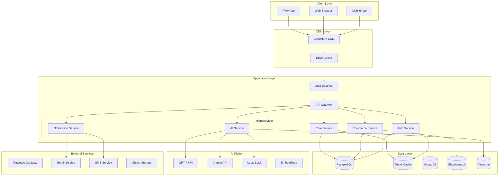
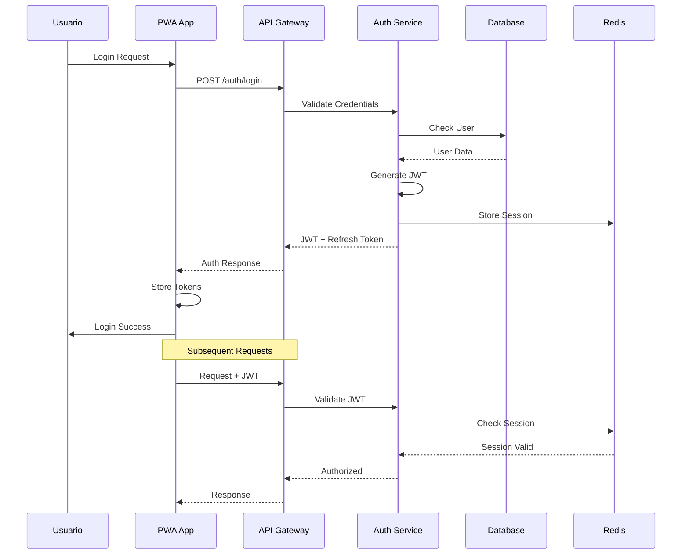
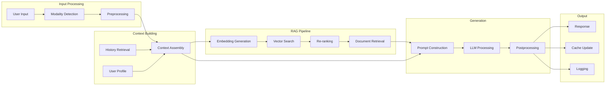

# 🚀 Blueprint Enterprise: Web Multifuncional PWA con IA Integrada

## 📋 Tabla de Contenidos

1. [Resumen Ejecutivo](#resumen-ejecutivo)
2. [Arquitectura General](#1-arquitectura-general)
3. [Stack Tecnológico](#2-stack-tecnológico)
4. [Estructura de Secciones](#3-estructura-de-secciones)
5. [Funcionalidades PWA](#4-funcionalidades-pwa)
6. [Sistema de IA Integrada](#5-sistema-de-ia-integrada)
7. [Arquitectura de Microservicios](#6-arquitectura-de-microservicios)
8. [Seguridad y Compliance](#7-seguridad-y-compliance)
9. [Infraestructura y DevOps](#8-infraestructura-y-devops)
10. [Mapa de Navegación](#9-mapa-de-navegación)
11. [Diagramas Técnicos](#10-diagramas-técnicos)
12. [Roadmap de Implementación](#11-roadmap-de-implementación)

---

## Resumen Ejecutivo

Este documento define la arquitectura completa de una plataforma web enterprise de próxima generación, combinando las capacidades de Progressive Web App (PWA) con inteligencia artificial integrada. La solución está diseñada para escalar horizontalmente, ofrecer experiencias personalizadas y mantener los más altos estándares de seguridad y rendimiento.

### Características Clave
- ✅ **PWA Nativa**: Instalable, offline-first, notificaciones push
- ✅ **IA Multimodal**: Chat, voz, recomendaciones, automatización
- ✅ **Enterprise-Ready**: Escalable, segura, GDPR compliant
- ✅ **Full-Stack Modern**: Next.js, NestJS, PostgreSQL, Kubernetes
- ✅ **Observabilidad Total**: Métricas, logs, trazas distribuidas

---

## 1. ARQUITECTURA GENERAL

### 1.1 Arquitectura de Alto Nivel

```
┌─────────────────────────────────────────────────────────────┐
│                         CDN GLOBAL                           │
│                    (Cloudflare/AWS CloudFront)               │
└─────────────────┬───────────────────────────────────────────┘
                  │
┌─────────────────▼───────────────────────────────────────────┐
│                      FRONTEND LAYER                          │
│  Next.js 14+ (App Router) + React 18 + TailwindCSS + PWA    │
└─────────────────┬───────────────────────────────────────────┘
                  │
┌─────────────────▼───────────────────────────────────────────┐
│                    API GATEWAY (Kong/Nginx)                  │
│              Rate Limiting | Auth | Load Balancing           │
└─────────────────┬───────────────────────────────────────────┘
                  │
┌─────────────────▼───────────────────────────────────────────┐
│                   BACKEND MICROSERVICES                      │
│  ┌──────────┐ ┌──────────┐ ┌──────────┐ ┌──────────┐      │
│  │   Core   │ │    IA    │ │ Commerce │ │  Admin   │      │
│  │   API    │ │  Service │ │  Service │ │ Service  │      │
│  └──────────┘ └──────────┘ └──────────┘ └──────────┘      │
│                        NestJS / Node.js                      │
└─────────────────┬───────────────────────────────────────────┘
                  │
┌─────────────────▼───────────────────────────────────────────┐
│                      DATA LAYER                              │
│  ┌──────────────┐ ┌──────────────┐ ┌──────────────┐       │
│  │  PostgreSQL  │ │    Redis     │ │ Elasticsearch│       │
│  │   (Primary)  │ │   (Cache)    │ │   (Search)   │       │
│  └──────────────┘ └──────────────┘ └──────────────┘       │
└──────────────────────────────────────────────────────────────┘
```

### 1.2 Principios de Diseño

1. **API-First**: Todas las funcionalidades expuestas vía API REST/GraphQL
2. **Mobile-First**: Diseño responsive con PWA como prioridad
3. **Cloud-Native**: Containerización completa con Kubernetes
4. **Security by Design**: Cifrado end-to-end, zero-trust architecture
5. **AI-Powered**: IA integrada en cada capa de la aplicación
6. **Event-Driven**: Arquitectura basada en eventos (Kafka/RabbitMQ)
7. **Microservicios**: Servicios desacoplados y escalables independientemente

---

## 2. STACK TECNOLÓGICO

### 2.1 Frontend

| Tecnología | Versión | Propósito |
|------------|---------|-----------|
| **Next.js** | 14+ | Framework React con SSR/SSG/ISR |
| **React** | 18+ | Librería UI con Concurrent Features |
| **TypeScript** | 5+ | Type Safety y mejor DX |
| **TailwindCSS** | 3+ | Utility-first CSS framework |
| **shadcn/ui** | Latest | Componentes UI accesibles |
| **Zustand** | 4+ | State Management ligero |
| **React Query** | 5+ | Server State Management |
| **Workbox** | 7+ | Service Worker toolkit |
| **Framer Motion** | 11+ | Animaciones fluidas |
| **React Hook Form** | 7+ | Formularios performantes |
| **Zod** | 3+ | Validación de esquemas |

### 2.2 Backend

| Tecnología | Versión | Propósito |
|------------|---------|-----------|
| **NestJS** | 10+ | Framework Node.js enterprise |
| **Node.js** | 20 LTS | Runtime JavaScript |
| **TypeORM** | 0.3+ | ORM para PostgreSQL |
| **Bull** | 4+ | Queue management |
| **Passport** | 0.6+ | Authentication middleware |
| **class-validator** | 0.14+ | DTO validation |
| **@nestjs/graphql** | 12+ | GraphQL integration |
| **Socket.io** | 4+ | Real-time WebSockets |

### 2.3 Base de Datos y Cache

| Tecnología | Versión | Propósito |
|------------|---------|-----------|
| **PostgreSQL** | 16+ | Base de datos principal |
| **Redis** | 7+ | Cache y session store |
| **Elasticsearch** | 8+ | Full-text search |
| **MinIO** | Latest | Object storage (S3-compatible) |
| **MongoDB** | 7+ | Logs y datos no estructurados |

### 2.4 IA y Machine Learning

| Tecnología | Propósito |
|------------|-----------|
| **OpenAI API** | GPT-4, Embeddings, Whisper |
| **LangChain** | Orquestación de LLMs |
| **Pinecone** | Vector database para RAG |
| **ElevenLabs** | Text-to-Speech avanzado |
| **Stable Diffusion** | Generación de imágenes |
| **TensorFlow.js** | ML en el navegador |
| **Hugging Face** | Modelos pre-entrenados |

### 2.5 DevOps y Infraestructura

| Tecnología | Propósito |
|------------|-----------|
| **Docker** | Containerización |
| **Kubernetes** | Orquestación de containers |
| **Helm** | Package manager para K8s |
| **ArgoCD** | GitOps y CD |
| **GitHub Actions** | CI/CD pipelines |
| **Terraform** | Infrastructure as Code |
| **Prometheus + Grafana** | Monitoreo y métricas |
| **ELK Stack** | Logging centralizado |
| **Jaeger** | Distributed tracing |
| **SonarQube** | Code quality |

---

## 3. ESTRUCTURA DE SECCIONES

### 3.1 HOME - Landing Page Inteligente

#### Componentes Principales

```typescript
interface HomePageStructure {
  hero: {
    headline: string;
    subheadline: string;
    cta: {
      primary: Button;
      secondary: Button;
    };
    aiWidget: AIAssistantWidget;
    backgroundVideo: VideoComponent;
  };
  
  features: {
    grid: FeatureCard[];
    animation: ScrollTriggeredAnimation;
  };
  
  services: {
    carousel: ServicePreview[];
    quickAccess: ServiceQuickLinks[];
  };
  
  products: {
    featured: ProductCard[];
    recommendations: AIRecommendationEngine;
  };
  
  testimonials: {
    slider: TestimonialCard[];
    trustBadges: TrustIndicator[];
  };
  
  metrics: {
    counters: AnimatedCounter[];
    liveData: RealtimeMetrics;
  };
}
```

#### Funcionalidades Específicas

- **Hero Dinámico**: Contenido personalizado basado en comportamiento del usuario
- **IA Widget Flotante**: Asistente accesible desde cualquier punto
- **Lazy Loading**: Carga progresiva de secciones
- **A/B Testing**: Variantes de contenido para optimización
- **Personalización**: Contenido adaptado según perfil del usuario

### 3.2 SOBRE NOSOTROS - Corporate Identity

```typescript
interface AboutUsStructure {
  header: {
    title: string;
    breadcrumb: BreadcrumbComponent;
  };
  
  story: {
    timeline: InteractiveTimeline;
    milestones: MilestoneCard[];
  };
  
  mission: {
    statement: AnimatedText;
    values: ValueCard[];
    vision: VisionComponent;
  };
  
  team: {
    leadership: TeamMemberCard[];
    departments: DepartmentSection[];
    culture: CultureGallery;
  };
  
  achievements: {
    awards: AwardCard[];
    certifications: CertificationBadge[];
    partners: PartnerLogo[];
  };
}
```

### 3.3 SERVICIOS/SOLUCIONES - Service Catalog

```typescript
interface ServicesStructure {
  navigation: {
    categories: CategoryFilter[];
    search: SmartSearchBar;
    filters: AdvancedFilters;
  };
  
  listing: {
    grid: ServiceCard[];
    view: 'grid' | 'list' | 'compact';
    sorting: SortingOptions;
    pagination: PaginationComponent;
  };
  
  detail: {
    overview: ServiceOverview;
    features: FeatureList;
    pricing: PricingCalculator;
    faq: FAQAccordion;
    cta: CTASection;
    relatedServices: RelatedServiceCarousel;
  };
  
  integration: {
    caseStudies: CaseStudyLink[];
    contactForm: QuickContactForm;
    scheduling: AppointmentScheduler;
  };
}
```

### 3.4 MARKETPLACE - E-commerce Platform

```typescript
interface MarketplaceStructure {
  catalog: {
    products: ProductGrid;
    filters: {
      category: CategoryTree;
      price: PriceRangeSlider;
      attributes: DynamicAttributeFilters;
      ai: AIFilterSuggestions;
    };
    search: {
      bar: AutocompleteSearchBar;
      voice: VoiceSearchButton;
      visual: ImageSearchUpload;
    };
  };
  
  product: {
    gallery: ImageGallery;
    info: ProductInformation;
    variants: VariantSelector;
    reviews: ReviewSection;
    recommendations: AIRecommendations;
    ar: ARViewer; // Realidad aumentada
  };
  
  cart: {
    items: CartItemList;
    summary: OrderSummary;
    promocodes: PromoCodeInput;
    suggestions: CrossSellProducts;
  };
  
  checkout: {
    steps: CheckoutWizard;
    payment: PaymentGateway;
    shipping: ShippingCalculator;
    confirmation: OrderConfirmation;
  };
}
```

### 3.5 BLOG/RECURSOS - Content Hub

```typescript
interface BlogStructure {
  listing: {
    articles: ArticleCard[];
    categories: CategorySidebar;
    tags: TagCloud;
    search: ContentSearch;
    filters: ContentFilters;
  };
  
  article: {
    header: ArticleHeader;
    content: RichTextContent;
    toc: TableOfContents;
    author: AuthorInfo;
    related: RelatedArticles;
    comments: CommentSection;
    sharing: SocialSharing;
  };
  
  resources: {
    downloads: {
      ebooks: DownloadableResource[];
      whitepapers: WhitepaperList[];
      templates: TemplateGallery[];
    };
    multimedia: {
      videos: VideoLibrary;
      podcasts: PodcastPlayer;
      webinars: WebinarArchive;
    };
  };
  
  ai: {
    summarizer: ArticleSummarizer;
    tagger: AutoTagger;
    translator: ContentTranslator;
    narrator: TextToSpeech;
  };
}
```

### 3.6 SOPORTE/FAQ - Help Center

```typescript
interface SupportStructure {
  helpCenter: {
    search: IntelligentSearch;
    categories: HelpCategoryGrid;
    popular: PopularArticles;
    videos: TutorialVideos;
  };
  
  faq: {
    sections: FAQSection[];
    search: FAQSearch;
    voting: HelpfulnessVoting;
    suggestions: AIFAQSuggestions;
  };
  
  contact: {
    channels: {
      chat: LiveChatWidget;
      email: ContactForm;
      phone: PhoneSupport;
      social: SocialMediaLinks;
    };
    ticketing: {
      create: TicketCreationForm;
      tracking: TicketTracker;
      history: TicketHistory;
    };
  };
  
  ai: {
    chatbot: AIAssistant;
    voicebot: VoiceAssistant;
    troubleshooter: AutomatedTroubleshooter;
    sentiment: SentimentAnalyzer;
  };
}
```

### 3.7 CUENTA DE USUARIO (PWA Dashboard)

```typescript
interface UserAccountStructure {
  dashboard: {
    overview: DashboardWidgets[];
    notifications: NotificationCenter;
    quickActions: QuickActionButtons;
    metrics: UserMetrics;
  };
  
  profile: {
    info: ProfileInformation;
    avatar: AvatarUploader;
    preferences: UserPreferences;
    security: SecuritySettings;
    privacy: PrivacyControls;
  };
  
  activity: {
    orders: OrderHistory;
    bookings: BookingManager;
    subscriptions: SubscriptionManager;
    downloads: DownloadHistory;
    interactions: AIInteractionLog;
  };
  
  wallet: {
    balance: WalletBalance;
    transactions: TransactionHistory;
    methods: PaymentMethods;
    rewards: RewardsProgram;
  };
  
  settings: {
    notifications: NotificationPreferences;
    appearance: ThemeSelector;
    language: LanguageSelector;
    accessibility: AccessibilityOptions;
    dataExport: GDPRDataExport;
  };
}
```

### 3.8 ADMIN/BACKOFFICE - Management System

```typescript
interface AdminStructure {
  dashboard: {
    kpis: KPIDashboard;
    analytics: AnalyticsOverview;
    alerts: SystemAlerts;
    reports: ReportGenerator;
  };
  
  content: {
    cms: {
      pages: PageBuilder;
      posts: BlogManager;
      media: MediaLibrary;
      seo: SEOManager;
    };
    products: {
      catalog: ProductManager;
      inventory: InventoryControl;
      pricing: PricingEngine;
      promotions: PromotionManager;
    };
  };
  
  users: {
    management: UserManagement;
    roles: RoleManager;
    permissions: PermissionMatrix;
    activity: UserActivityLog;
  };
  
  ai: {
    monitoring: AIMonitoringDashboard;
    prompts: PromptManager;
    training: ModelTraining;
    analytics: AIUsageAnalytics;
    costs: AICostTracker;
  };
  
  system: {
    settings: SystemConfiguration;
    integrations: IntegrationManager;
    backup: BackupManager;
    logs: LogViewer;
    health: HealthMonitor;
  };
}
```

---

## 4. FUNCIONALIDADES PWA

### 4.1 Service Worker Implementation

```javascript
// service-worker.js
const CACHE_NAME = 'pwa-cache-v1';
const DYNAMIC_CACHE = 'dynamic-cache-v1';

// Estrategias de caché
const cacheStrategies = {
  static: [
    '/',
    '/offline.html',
    '/manifest.json',
    '/static/css/main.css',
    '/static/js/main.js'
  ],
  
  networkFirst: [
    '/api/user',
    '/api/notifications',
    '/api/live-data'
  ],
  
  cacheFirst: [
    '/static/images/',
    '/static/fonts/',
    '/assets/'
  ],
  
  staleWhileRevalidate: [
    '/api/products',
    '/api/content',
    '/api/config'
  ]
};

// Background Sync
self.addEventListener('sync', event => {
  if (event.tag === 'sync-forms') {
    event.waitUntil(syncPendingForms());
  }
});

// Push Notifications
self.addEventListener('push', event => {
  const data = event.data.json();
  event.waitUntil(
    self.registration.showNotification(data.title, {
      body: data.body,
      icon: data.icon,
      badge: data.badge,
      actions: data.actions
    })
  );
});
```

### 4.2 Manifest Configuration

```json
{
  "name": "Enterprise PWA Platform",
  "short_name": "EnterprisePWA",
  "description": "Plataforma multifuncional con IA integrada",
  "start_url": "/",
  "display": "standalone",
  "theme_color": "#000000",
  "background_color": "#ffffff",
  "orientation": "portrait-primary",
  "scope": "/",
  "icons": [
    {
      "src": "/icons/icon-72x72.png",
      "sizes": "72x72",
      "type": "image/png",
      "purpose": "maskable"
    },
    {
      "src": "/icons/icon-512x512.png",
      "sizes": "512x512",
      "type": "image/png",
      "purpose": "any"
    }
  ],
  "screenshots": [
    {
      "src": "/screenshots/home.png",
      "sizes": "1280x720",
      "type": "image/png"
    }
  ],
  "shortcuts": [
    {
      "name": "Dashboard",
      "url": "/dashboard",
      "icon": "/icons/dashboard.png"
    },
    {
      "name": "AI Assistant",
      "url": "/ai-chat",
      "icon": "/icons/ai.png"
    }
  ],
  "share_target": {
    "action": "/share",
    "method": "POST",
    "enctype": "multipart/form-data",
    "params": {
      "title": "title",
      "text": "text",
      "url": "url",
      "files": [{
        "name": "media",
        "accept": ["image/*", "video/*"]
      }]
    }
  },
  "protocol_handlers": [
    {
      "protocol": "web+enterprise",
      "url": "/protocol?url=%s"
    }
  ]
}
```

### 4.3 Funcionalidades PWA Avanzadas

```typescript
interface PWAFeatures {
  installation: {
    prompt: BeforeInstallPrompt;
    banner: InstallBanner;
    metrics: InstallationMetrics;
  };
  
  offline: {
    fallback: OfflinePage;
    queue: BackgroundSyncQueue;
    indicator: OfflineIndicator;
  };
  
  notifications: {
    permission: NotificationPermission;
    channels: NotificationChannel[];
    scheduler: NotificationScheduler;
    analytics: NotificationAnalytics;
  };
  
  updates: {
    detector: UpdateDetector;
    prompt: UpdatePrompt;
    strategy: UpdateStrategy;
  };
  
  performance: {
    caching: CacheStrategy;
    preload: ResourcePreloader;
    optimization: PerformanceOptimizer;
  };
  
  capabilities: {
    camera: MediaCapture;
    location: GeolocationAPI;
    contacts: ContactPicker;
    share: WebShareAPI;
    payment: PaymentRequestAPI;
    bluetooth: WebBluetoothAPI;
    nfc: WebNFCAPI;
  };
}
```

---

## 5. SISTEMA DE IA INTEGRADA

### 5.1 Arquitectura de IA

```typescript
interface AIArchitecture {
  core: {
    orchestrator: AIOrchestrator;
    router: ModelRouter;
    cache: ResponseCache;
    fallback: FallbackStrategy;
  };
  
  models: {
    llm: {
      primary: 'gpt-4-turbo';
      fallback: 'claude-3-sonnet';
      local: 'llama-3-70b';
    };
    
    embedding: {
      text: 'text-embedding-3-large';
      multimodal: 'clip-vit-large';
    };
    
    specialized: {
      vision: 'gpt-4-vision';
      audio: 'whisper-large-v3';
      tts: 'elevenlabs-multilingual';
      translation: 'nllb-200-3.3B';
    };
  };
  
  features: {
    chat: {
      contextManager: ConversationContext;
      memoryStore: VectorMemory;
      personality: PersonalityEngine;
      moderation: ContentModeration;
    };
    
    recommendations: {
      engine: RecommendationEngine;
      collaborative: CollaborativeFiltering;
      contentBased: ContentBasedFiltering;
      hybrid: HybridRecommender;
    };
    
    automation: {
      contentGeneration: ContentGenerator;
      emailAutomation: EmailAIComposer;
      reportGeneration: ReportBuilder;
      dataExtraction: DataExtractor;
    };
    
    analytics: {
      sentimentAnalysis: SentimentAnalyzer;
      intentDetection: IntentClassifier;
      entityRecognition: NEREngine;
      topicModeling: TopicExtractor;
    };
  };
}
```

### 5.2 RAG (Retrieval-Augmented Generation)

```typescript
interface RAGSystem {
  ingestion: {
    crawler: WebCrawler;
    parser: DocumentParser;
    chunker: TextChunker;
    embedder: EmbeddingGenerator;
  };
  
  storage: {
    vectorDB: {
      primary: 'pinecone';
      indexes: VectorIndex[];
      dimensions: 1536;
    };
    
    metadata: {
      store: 'postgresql';
      schema: MetadataSchema;
    };
  };
  
  retrieval: {
    search: {
      semantic: SemanticSearch;
      hybrid: HybridSearch;
      reranker: Reranker;
    };
    
    context: {
      builder: ContextBuilder;
      window: ContextWindow;
      compression: ContextCompressor;
    };
  };
  
  generation: {
    promptTemplate: PromptTemplate;
    chainOfThought: CoTReasoning;
    factChecking: FactVerifier;
    citations: CitationGenerator;
  };
}
```

### 5.3 Implementación de Chat Multimodal

```typescript
class MultimodalChatService {
  private models: ModelRegistry;
  private context: ContextManager;
  private memory: ConversationMemory;
  
  async processMessage(input: MultimodalInput): Promise<Response> {
    // Detección de modalidad
    const modality = this.detectModality(input);
    
    // Procesamiento según tipo
    switch(modality) {
      case 'text':
        return this.processText(input.text);
      
      case 'voice':
        const transcript = await this.transcribeAudio(input.audio);
        return this.processText(transcript);
      
      case 'image':
        const analysis = await this.analyzeImage(input.image);
        return this.generateImageResponse(analysis);
      
      case 'multimodal':
        return this.processMultimodal(input);
    }
  }
  
  private async processText(text: string): Promise<TextResponse> {
    // Enriquecimiento de contexto
    const context = await this.context.build(text);
    
    // Recuperación RAG
    const relevant = await this.retrieveRelevant(text);
    
    // Generación de respuesta
    const response = await this.generate({
      query: text,
      context: context,
      knowledge: relevant,
      history: this.memory.getHistory()
    });
    
    // Guardar en memoria
    this.memory.add(text, response);
    
    return response;
  }
}
```

### 5.4 Sistema de Recomendaciones

```typescript
class AIRecommendationEngine {
  private collaborativeFilter: CollaborativeFiltering;
  private contentBasedFilter: ContentBasedFiltering;
  private deepLearningModel: DeepRecommender;
  
  async getRecommendations(
    userId: string,
    context: RecommendationContext
  ): Promise<Recommendation[]> {
    // Obtener embeddings del usuario
    const userEmbedding = await this.getUserEmbedding(userId);
    
    // Recomendaciones colaborativas
    const collaborative = await this.collaborativeFilter.recommend(
      userId,
      context
    );
    
    // Recomendaciones basadas en contenido
    const contentBased = await this.contentBasedFilter.recommend(
      userEmbedding,
      context
    );
    
    // Recomendaciones deep learning
    const deepLearning = await this.deepLearningModel.predict(
      userId,
      context
    );
    
    // Fusión y ranking
    return this.fuseAndRank([
      ...collaborative,
      ...contentBased,
      ...deepLearning
    ]);
  }
  
  private async fuseAndRank(
    recommendations: Recommendation[]
  ): Promise<Recommendation[]> {
    // Eliminar duplicados
    const unique = this.removeDuplicates(recommendations);
    
    // Re-ranking con modelo de ML
    const reranked = await this.rerank(unique);
    
    // Aplicar reglas de negocio
    const filtered = this.applyBusinessRules(reranked);
    
    // Diversificación
    return this.diversify(filtered);
  }
}
```

---

## 6. ARQUITECTURA DE MICROSERVICIOS

### 6.1 Diseño de Servicios

```yaml
services:
  core-service:
    responsibility: "Lógica de negocio principal"
    endpoints:
      - GET /api/v1/health
      - GET /api/v1/config
      - POST /api/v1/auth/login
      - POST /api/v1/auth/refresh
    database: PostgreSQL
    cache: Redis
    events:
      publishes:
        - user.created
        - user.updated
      subscribes:
        - payment.completed
        - order.fulfilled
  
  ai-service:
    responsibility: "Procesamiento de IA"
    endpoints:
      - POST /api/v1/ai/chat
      - POST /api/v1/ai/embeddings
      - POST /api/v1/ai/recommendations
      - POST /api/v1/ai/analyze
    models:
      - GPT-4
      - Claude-3
      - Llama-3
    vectorDB: Pinecone
    queue: Bull/Redis
  
  commerce-service:
    responsibility: "E-commerce y marketplace"
    endpoints:
      - GET /api/v1/products
      - POST /api/v1/cart
      - POST /api/v1/orders
      - POST /api/v1/payments
    database: PostgreSQL
    search: Elasticsearch
    events:
      publishes:
        - order.created
        - payment.processed
        - inventory.updated
  
  notification-service:
    responsibility: "Comunicaciones"
    endpoints:
      - POST /api/v1/notifications/send
      - GET /api/v1/notifications/templates
    channels:
      - email (SendGrid)
      - sms (Twilio)
      - push (FCM)
      - in-app (WebSocket)
    queue: RabbitMQ
  
  analytics-service:
    responsibility: "Analytics y reporting"
    endpoints:
      - GET /api/v1/analytics/dashboard
      - POST /api/v1/analytics/track
    storage: ClickHouse
    processing: Apache Spark
    visualization: Grafana
```

### 6.2 Comunicación Inter-servicios

```typescript
interface ServiceCommunication {
  sync: {
    rest: {
      protocol: 'HTTP/2';
      format: 'JSON';
      authentication: 'JWT';
      timeout: 30000;
    };
    
    graphql: {
      gateway: 'Apollo Federation';
      schemas: SubgraphSchema[];
      caching: 'Redis';
    };
    
    grpc: {
      protocol: 'HTTP/2';
      format: 'Protocol Buffers';
      streaming: boolean;
    };
  };
  
  async: {
    messageQueue: {
      broker: 'RabbitMQ';
      exchanges: Exchange[];
      queues: Queue[];
      dlq: DeadLetterQueue;
    };
    
    eventBus: {
      platform: 'Apache Kafka';
      topics: Topic[];
      partitions: number;
      replication: number;
    };
    
    pubsub: {
      provider: 'Redis Pub/Sub';
      channels: Channel[];
      patterns: SubscriptionPattern[];
    };
  };
}
```

---

## 7. SEGURIDAD Y COMPLIANCE

### 7.1 Arquitectura de Seguridad

```typescript
interface SecurityArchitecture {
  authentication: {
    methods: ['JWT', 'OAuth2', 'SAML', 'MFA'];
    providers: ['Auth0', 'Cognito', 'Firebase'];
    session: {
      storage: 'Redis';
      duration: 3600;
      refresh: true;
    };
  };
  
  authorization: {
    model: 'RBAC'; // Role-Based Access Control
    permissions: PermissionMatrix;
    policies: PolicyEngine;
    enforcement: 'API Gateway + Service Level';
  };
  
  encryption: {
    transit: {
      protocol: 'TLS 1.3';
      certificates: 'Let\'s Encrypt';
      hsts: true;
    };
    
    rest: {
      algorithm: 'AES-256-GCM';
      keyManagement: 'AWS KMS';
      rotation: 'Quarterly';
    };
  };
  
  protection: {
    waf: 'Cloudflare WAF';
    ddos: 'Cloudflare DDoS Protection';
    rateLimit: {
      global: 10000; // requests per hour
      perUser: 1000;
      perEndpoint: CustomLimits;
    };
    
    csrf: {
      tokens: true;
      sameSite: 'Strict';
    };
    
    xss: {
      csp: ContentSecurityPolicy;
      sanitization: 'DOMPurify';
    };
  };
}
```

### 7.2 GDPR Compliance

```typescript
interface GDPRCompliance {
  dataSubjectRights: {
    access: DataAccessRequest;
    rectification: DataUpdateRequest;
    erasure: DataDeletionRequest; // Right to be forgotten
    portability: DataExportRequest;
    restriction: ProcessingRestriction;
    objection: ProcessingObjection;
  };
  
  consent: {
    management: ConsentManager;
    granularity: 'Purpose-based';
    withdrawal: ConsentWithdrawal;
    audit: ConsentAuditLog;
  };
  
  privacy: {
    byDesign: PrivacyByDesign;
    impact: PrivacyImpactAssessment;
    notices: PrivacyNotice[];
    cookies: CookieConsent;
  };
  
  breach: {
    detection: BreachDetection;
    notification: {
      authorities: 72; // hours
      individuals: 'Without undue delay';
    };
    documentation: BreachRegister;
  };
}
```

---

## 8. INFRAESTRUCTURA Y DEVOPS

### 8.1 Kubernetes Configuration

```yaml
# deployment.yaml
apiVersion: apps/v1
kind: Deployment
metadata:
  name: frontend-deployment
  namespace: production
spec:
  replicas: 3
  strategy:
    type: RollingUpdate
    rollingUpdate:
      maxSurge: 1
      maxUnavailable: 0
  selector:
    matchLabels:
      app: frontend
  template:
    metadata:
      labels:
        app: frontend
    spec:
      containers:
      - name: frontend
        image: registry.enterprise.com/frontend:v1.0.0
        ports:
        - containerPort: 3000
        resources:
          requests:
            memory: "256Mi"
            cpu: "250m"
          limits:
            memory: "512Mi"
            cpu: "500m"
        livenessProbe:
          httpGet:
            path: /health
            port: 3000
          initialDelaySeconds: 30
          periodSeconds: 10
        readinessProbe:
          httpGet:
            path: /ready
            port: 3000
          initialDelaySeconds: 5
          periodSeconds: 5
        env:
        - name: NODE_ENV
          value: "production"
        - name: API_URL
          valueFrom:
            configMapKeyRef:
              name: app-config
              key: api.url
---
apiVersion: v1
kind: Service
metadata:
  name: frontend-service
spec:
  selector:
    app: frontend
  ports:
  - protocol: TCP
    port: 80
    targetPort: 3000
  type: LoadBalancer
---
apiVersion: autoscaling/v2
kind: HorizontalPodAutoscaler
metadata:
  name: frontend-hpa
spec:
  scaleTargetRef:
    apiVersion: apps/v1
    kind: Deployment
    name: frontend-deployment
  minReplicas: 3
  maxReplicas: 10
  metrics:
  - type: Resource
    resource:
      name: cpu
      target:
        type: Utilization
        averageUtilization: 70
  - type: Resource
    resource:
      name: memory
      target:
        type: Utilization
        averageUtilization: 80
```

### 8.2 CI/CD Pipeline

```yaml
# .github/workflows/main.yml
name: CI/CD Pipeline

on:
  push:
    branches: [main, develop]
  pull_request:
    branches: [main]

jobs:
  test:
    runs-on: ubuntu-latest
    steps:
      - uses: actions/checkout@v3
      
      - name: Setup Node.js
        uses: actions/setup-node@v3
        with:
          node-version: '20'
          cache: 'npm'
      
      - name: Install dependencies
        run: npm ci
      
      - name: Run tests
        run: npm run test:ci
      
      - name: Run E2E tests
        run: npm run test:e2e
      
      - name: SonarQube Scan
        uses: sonarsource/sonarqube-scan-action@master
        env:
          GITHUB_TOKEN: ${{ secrets.GITHUB_TOKEN }}
          SONAR_TOKEN: ${{ secrets.SONAR_TOKEN }}
  
  build:
    needs: test
    runs-on: ubuntu-latest
    steps:
      - uses: actions/checkout@v3
      
      - name: Build Docker image
        run: |
          docker build -t ${{ secrets.REGISTRY }}/app:${{ github.sha }} .
          docker build -t ${{ secrets.REGISTRY }}/app:latest .
      
      - name: Push to registry
        run: |
          echo ${{ secrets.REGISTRY_PASSWORD }} | docker login -u ${{ secrets.REGISTRY_USERNAME }} --password-stdin
          docker push ${{ secrets.REGISTRY }}/app:${{ github.sha }}
          docker push ${{ secrets.REGISTRY }}/app:latest
  
  deploy:
    needs: build
    runs-on: ubuntu-latest
    if: github.ref == 'refs/heads/main'
    steps:
      - name: Deploy to Kubernetes
        run: |
          kubectl set image deployment/frontend-deployment \
            frontend=${{ secrets.REGISTRY }}/app:${{ github.sha }} \
            --namespace=production
      
      - name: Wait for rollout
        run: |
          kubectl rollout status deployment/frontend-deployment \
            --namespace=production
      
      - name: Run smoke tests
        run: npm run test:smoke
```

### 8.3 Monitoreo y Observabilidad

```typescript
interface ObservabilityStack {
  metrics: {
    collector: 'Prometheus';
    storage: 'VictoriaMetrics';
    visualization: 'Grafana';
    alerts: 'AlertManager';
    
    custom: {
      business: BusinessMetrics[];
      technical: TechnicalMetrics[];
      sla: SLAIndicators[];
    };
  };
  
  logging: {
    aggregation: 'Elasticsearch';
    ingestion: 'Logstash';
    visualization: 'Kibana';
    
    levels: {
      error: ErrorLogger;
      warning: WarningLogger;
      info: InfoLogger;
      debug: DebugLogger;
    };
  };
  
  tracing: {
    collector: 'Jaeger';
    sampling: 'Adaptive';
    storage: 'Cassandra';
    
    instrumentation: {
      auto: 'OpenTelemetry';
      manual: CustomTracing;
    };
  };
  
  apm: {
    platform: 'DataDog | New Relic';
    realUserMonitoring: true;
    syntheticMonitoring: true;
    errorTracking: 'Sentry';
  };
}
```

---

## 9. MAPA DE NAVEGACIÓN

### 9.1 Estructura Jerárquica

```
🏠 HOME
├── 📋 SOBRE NOSOTROS
│   ├── Historia
│   ├── Misión y Valores
│   ├── Equipo
│   ├── Partners
│   └── Reconocimientos
│
├── 🛠️ SERVICIOS
│   ├── Consultoría
│   │   ├── Estrategia Digital
│   │   ├── Transformación
│   │   └── Optimización
│   ├── Desarrollo
│   │   ├── Web
│   │   ├── Mobile
│   │   └── IA/ML
│   └── Soporte
│       ├── Mantenimiento
│       ├── Hosting
│       └── SLA
│
├── 🛍️ MARKETPLACE
│   ├── Categorías
│   │   ├── Software
│   │   ├── Templates
│   │   ├── Plugins
│   │   └── Servicios
│   ├── Productos Destacados
│   ├── Ofertas
│   └── Carrito
│
├── 👥 CLIENTES
│   ├── Casos de Éxito
│   ├── Testimonios
│   ├── Portfolio
│   └── Industries
│
├── 📚 BLOG/RECURSOS
│   ├── Artículos
│   ├── Tutoriales
│   ├── Whitepapers
│   ├── Webinars
│   └── Newsletter
│
├── 🆘 SOPORTE
│   ├── Centro de Ayuda
│   ├── FAQ
│   ├── Documentación
│   ├── Estado del Sistema
│   └── Contacto Soporte
│
├── 👤 MI CUENTA [PWA]
│   ├── Dashboard
│   ├── Perfil
│   ├── Pedidos
│   ├── Suscripciones
│   ├── Facturas
│   ├── Tickets
│   └── Configuración
│
├── 📞 CONTACTO
│   ├── Formulario
│   ├── Ubicaciones
│   ├── Horarios
│   └── Chat en Vivo
│
└── ⚙️ ADMIN [Restringido]
    ├── Dashboard Admin
    ├── Gestión Contenido
    ├── Gestión Usuarios
    ├── E-commerce
    ├── Analytics
    ├── IA Control
    └── Sistema
```

### 9.2 Matriz de Enlaces Internos

| Desde / Hacia | Home | Servicios | Marketplace | Blog | Soporte | Cuenta | Contacto |
|---------------|------|-----------|-------------|------|---------|---------|----------|
| **Home** | - | ✓ | ✓ | ✓ | ✓ | ✓ | ✓ |
| **Servicios** | ✓ | - | ✓ | ✓ | ✓ | ✓ | ✓ |
| **Marketplace** | ✓ | ✓ | - | ✓ | ✓ | ✓ | ✓ |
| **Blog** | ✓ | ✓ | ✓ | - | ✓ | ✓ | ✓ |
| **Soporte** | ✓ | ✓ | ✓ | ✓ | - | ✓ | ✓ |
| **Cuenta** | ✓ | ✓ | ✓ | ✓ | ✓ | - | ✓ |
| **Contacto** | ✓ | ✓ | ✓ | ✓ | ✓ | ✓ | - |

---

## 10. DIAGRAMAS TÉCNICOS

### 10.1 Diagrama de Arquitectura General



### 10.2 Flujo de Autenticación



### 10.3 Pipeline de Procesamiento IA



---

## 11. ROADMAP DE IMPLEMENTACIÓN

### Fase 1: Foundation (Mes 1-2)
```
✅ Configuración de infraestructura base
✅ Setup de CI/CD
✅ Implementación de autenticación
✅ Core API development
✅ Database schema
✅ Basic frontend structure
```

### Fase 2: Core Features (Mes 3-4)
```
🔄 Desarrollo de servicios principales
🔄 Integración de CMS
🔄 Sistema de usuarios y roles
🔄 Marketplace básico
🔄 Blog y recursos
🔄 PWA implementation
```

### Fase 3: AI Integration (Mes 5-6)
```
⏳ Integración de LLMs
⏳ RAG system setup
⏳ Chat multimodal
⏳ Sistema de recomendaciones
⏳ Automatización con IA
⏳ Analytics con IA
```

### Fase 4: Advanced Features (Mes 7-8)
```
⏳ Notificaciones push avanzadas
⏳ Offline capabilities
⏳ Real-time features
⏳ Advanced analytics
⏳ A/B testing framework
⏳ Performance optimization
```

### Fase 5: Enterprise & Scale (Mes 9-10)
```
⏳ Multi-tenancy
⏳ Advanced security features
⏳ Compliance certifications
⏳ Global CDN optimization
⏳ Disaster recovery
⏳ Full observability stack
```

### Fase 6: Launch & Optimization (Mes 11-12)
```
⏳ Beta testing
⏳ Performance tuning
⏳ Security audit
⏳ Documentation complete
⏳ Training materials
⏳ Production launch
```

---

## 📊 KPIs y Métricas de Éxito

### Métricas Técnicas
- **Performance Score**: > 95/100 (Lighthouse)
- **Disponibilidad**: 99.99% SLA
- **Tiempo de Respuesta**: < 200ms p95
- **Error Rate**: < 0.1%
- **Cache Hit Ratio**: > 85%

### Métricas de Negocio
- **Conversión PWA**: > 40% instalación
- **Engagement Rate**: > 60%
- **AI Usage**: > 70% usuarios activos
- **Customer Satisfaction**: > 4.5/5
- **ROI**: > 300% en 18 meses

### Métricas de Seguridad
- **Zero Security Breaches**
- **100% GDPR Compliance**
- **A+ SSL Rating**
- **< 1hr Incident Response**
- **100% Audit Pass Rate**

---

## 🎯 Conclusión

Este blueprint representa una arquitectura enterprise completa y moderna que combina:

1. **Tecnología de Vanguardia**: PWA + IA + Cloud Native
2. **Escalabilidad Ilimitada**: Microservicios + Kubernetes
3. **Experiencia Superior**: UX/UI optimizada + Personalización
4. **Seguridad Robusta**: Zero-trust + GDPR + Enterprise Security
5. **Inteligencia Integrada**: LLMs + RAG + Automation

La implementación exitosa de esta arquitectura posicionará a la organización como líder en transformación digital, ofreciendo una plataforma que no solo cumple con las necesidades actuales, sino que está preparada para los desafíos futuros del mercado.

---

## 📚 Referencias y Recursos

- [Next.js Documentation](https://nextjs.org/docs)
- [NestJS Documentation](https://nestjs.com/)
- [PWA Best Practices](https://web.dev/progressive-web-apps/)
- [OpenAI Platform](https://platform.openai.com/)
- [Kubernetes Documentation](https://kubernetes.io/docs/)
- [OWASP Security Guidelines](https://owasp.org/)
- [GDPR Compliance Checklist](https://gdpr.eu/)

---

**Documento preparado por**: Architecture Team  
**Versión**: 1.0.0  
**Fecha**: 2024  
**Clasificación**: Enterprise Blueprint  
**Estado**: ✅ Complete